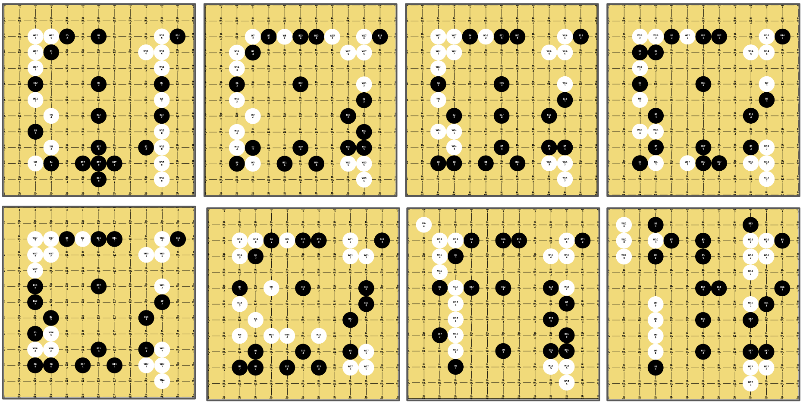
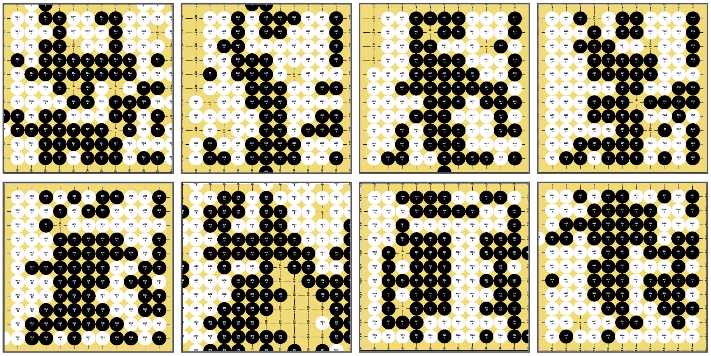
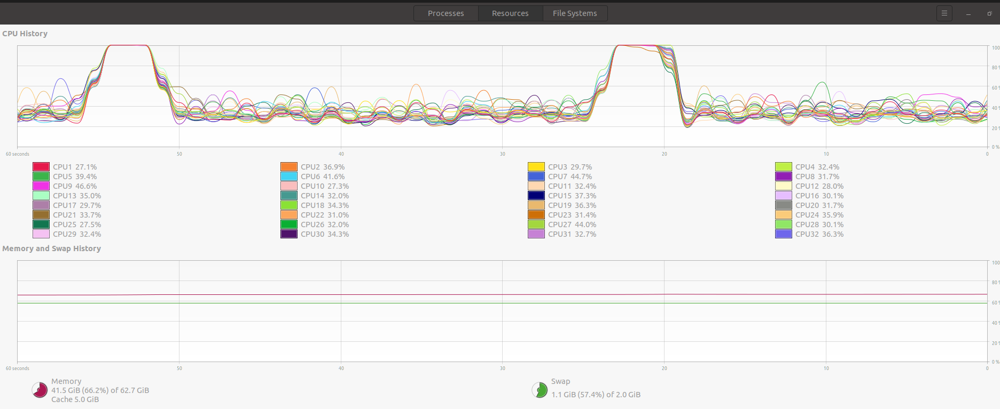
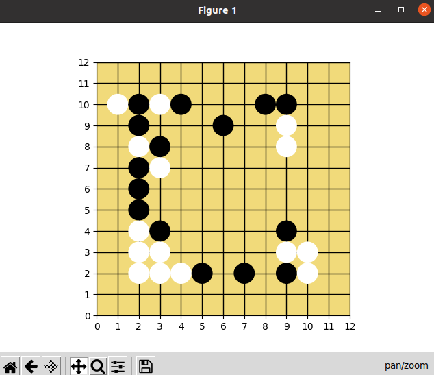
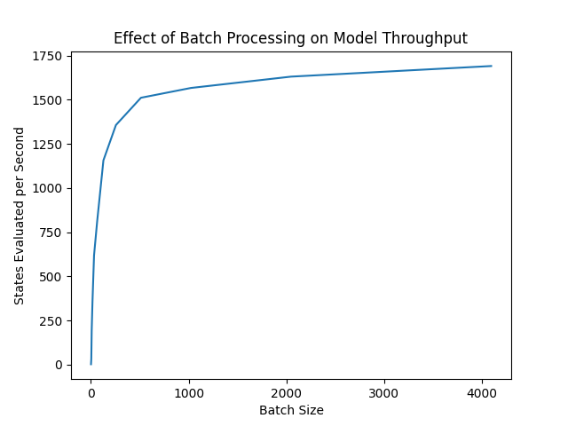

# WinGoBot: A Homegrown AlphaGo Zero Replica

This repository holds code for training and playing against replicas of Deep Mind's AlphaGo Zero bot, using a 13x13 Go board.
[Go](https://senseis.xmp.net/?Go) is the [world's oldest continuously played board game](https://senseis.xmp.net/?FunGoFacts),
and it has served as one of this generation's great AI challenges, due to its complexity and the size of its state space.
It is said that Go has more legal board configurations than there are atoms in the observable universe,
which makes brute force search for optimal moves impossible. Instead, the best approach to date involves a reduced tree
search, guided by the policy and value predictions of deep neural networks.


The _WinGoBots_ in this repository, named after the author, are implemented as policy-value neural networks,
which use Monte Carlo Tree Search (MCTS) to simulate gameplay prior to each move selection. The neural network architecture
and MCTS parameters are modeled closely after those described in the original DeepMind papers
on [AlphaGo](https://storage.googleapis.com/deepmind-media/alphago/AlphaGoNaturePaper.pdf) 
and [AlphaGo Zero](https://www.nature.com/articles/nature24270.epdf), with a few key exceptions.
The code is written to be highly scalable and designed to run on systems with multiple CPUs and GPUs.
This `README` contains instructions for training WinGoBots, playing against them, and analyzing their game output.

### Example Game Output
The following images show random samples of games played throughout the reinforcement learning process.
These examples represent the first 1600 batches of self play.
It may be noted that each of these examples are fairly similar to each other, especially in the opening stage.
This similarity can be attributed to a lack of exploration during the reinforcement learning process.
Potential solutions which would improve move diversity include:
 * increasing the number of MCTS simulations used during self play,
 * increasing the MCTS temperature parameter, which controls exploration.
 * increasing the number of game threads used for each batch of self play (more threads = more processing power required).
 * adding support for board reflection and rotation during self play, taking advantage of game symmetry. Work in progress.

#### Game Opening 


#### End Game


### Notable Differences
There are a few things that make a WinGoBot different than AlphaGo / AlphaGo Zero. These include:

* __Board Size__: AlphaGo was built for play on a 19x19 Goban (standard), 
                  while a WinGoBot is currently being trained for a 13x13 Goban. 
                  The smaller size reduces the search space and serves as a more 
                  feasible reinforcement learning project for a high performance desktop computer.
  
* __Game Specific Network Layers__: Whereas the AlphaGo network included input layers to represent state attributes
                                    specific to the game of Go, such as legality, ladder presence, and capture outcomes,
                                    the AlhpaGo Zero model features a more generic architecture that can be easily be
                                    transferred to other (similar) RL problems. The Zero architecture only uses game
                                    history and the color of the current player as its input. The WinGoBot architecture
                                    follows a mixed approach, by using the game history, current player, and 
                                    liberty count at each intersection.
  
* __Utilization of Game Symmetry__: During self play, the AlphaGo models perform reflections and rotations of the board
                                    at random during their MCTS rollouts. For every board configuration, there are eight
                                    different combinations of these transformations that are equivalent as far as the
                                    game rules are concerned, but look different to the neural networks. Using these
                                    transformations adds diversity to the game history and is an easy way to improve
                                    exploration. This has not yet been added to the WinGoBot tree search process, but
                                    it is a work in progress.
  
* __Access to Compute Power__: The weights file included in this repo in the `models` directory was trained on the
                               author's personal desktop (CPU: Threadripper 2950X (16 cores, 32 threads),
                               GPU: Nvidia 2060 Super). This machine, while powerful, is nowhere near as impressive as
                               the compute resources used by Google's DeepMind (i.e. hundreds of CPUs and GPUs).
                               Needless to say, the WinGoBot training has been much slower and smaller scale.
                                


## Setup
### Step 1: Clone This Repository
```
git clone https://github.com/ahwingo/wingobot.git
cd wingobot
```
### Step 2: Environment Configuration
The policy-value neural networks use 2D convolutional layers that currently require TensorFlow (TF) to run with GPU support.
This consequently requires your system to have the appropriate graphics drivers and CUDA versions installed.

#### The Easy Way (Docker)
The easiest way to run the WinGoBot code is through Docker, which simplifies the installation of TensorFlow and CUDA.

To install Docker, see https://docs.docker.com/engine/install/.

To install the Nvidia Container Toolkit, which allows Docker containers to access the host machine's GPUs,
see https://docs.nvidia.com/datacenter/cloud-native/container-toolkit/overview.html.

The `build.sh` and `activate.sh` scripts located in the `wingobot/docker` directory can be used to
build the Docker images and launch the development containers, respectively.

```
cd docker
./build.sh
cd ..
./docker/activate.sh  
# Or  ./docker/activate_x.sh  to run with a connection to an X display, in order to use the game play GUIs.
```

#### The Hard Way (Direct TF and CUDA Installation)
The latest version of the WinGoBot was trained using TensorFlow 2.3.1.
Detailed instructions for installing TensorFlow with GPU support can be found here: https://www.tensorflow.org/install/gpu

This requires cuDNN 7.6 and CUDA 10.1, which are supported on Ubuntu 18.04.
See https://www.tensorflow.org/install/source#linux for TF and CUDA compatibility charts.


## Bot Training
A WinGoBot can be trained through both supervised and reinforcement learning. Both methods require GPU support
and generate TF Keras weights files with the `.h5` extension as an output. The reinforcement learning method also
generates self play games, stored as `.h5` files.


### Supervised Learning
The code for supervised learning is located in the `supervised_training` directory.
It requires training data (either from self play games or other sources) stored as `.h5` files.
Supervised learning can be run with the following command:

```
python3 tnnlltf.py
        --bot_name <NAME OF THE BOT>
        --batch_size <NUMBER OF INPUT STATES PER MINI BATCH>
        --data_dir <PATH TO THE H5 GAMES>
        --output_dir <PATH TO WHERE THE TRAINING CHECKPOINT WEIGHTS SHOULD BE STORED>
```


### Reinforcement Learning
The code for reinforcement learning is located in the `reinforcement_training` directory.
It performs the process of self play and is highly parallelized, so that hundreds of games can be played simultaneously.
It requires a starting weights file, which can be created through the `PolicyValueNetwork` of the `source/nn_ll_tf.py`
utility file, or through supervised / reinforcement learning. Note that while two weights files are requested
(one for both players) these can be the same file. The self play process generates games and stores them as `.h5` files.
Self play can be run with the following command:

```
python3 self_play_multiprocessed.py
```

It supports the following command line arguments.

```
--game_threads:                The number of independent games to run in parallel processes.
--game_duration:               The total number of moves (white and black) to be played each game.
--num_simulations_leader:      The number of MCTS rollouts for the leading bot to execute.
--num_simulations_follower:    The number of MCTS rollouts for the following bot to execute.
--batches_per_training_cycle:  The number of batches to train over, whenever training is executed.
--training_cycles_per_save:    Save a new weights file after this many training cycles have passed.
--komi:                        The bonus points given to white, to account for playing second.
--weights_dir:                 The directory to save trained weights file to.
--leading_bot_name:            The name to associate the leading bot with.
--go_bot_1:                    The path to the starting weights file of the leading bot.
--go_bot_2:                    The path to the starting weights file of the following bot.
--game_output_dir:             The directory to save self play games, in h5 format, to.
```

NOTE: Self play is an extremely resource-intensive process. Systems with many CPU cores and lots of memory are recommended, but not required.
The image below shows the processing load caused by self play on the author's computer, running 256 simultaneous game 
threads, each 128 moves long, with 64 MCTS simulations per leading-bot move.
The peaks indicate the points at which moves are made and Monte Carlo search trees are reallocated.



## Play vs WinGoBot
Two methods are currently supported for play against a WinGoBot: CLI mode and GUI mode. To run either,
navigate to the `play` directory.

### CLI

```
python3 play_vs_bot_cli.py
        --length 128
        --simulations 64
        --color W
        --outfile human_vs_bot.sgf
        --botfile ../models/shodan_focal_fossa_161.h5
```

This command results in a board being printed to the command line, where users are prompted for input.

```
Row: 
2
Col: 
4
         0   1   2   3   4   5   6   7   8   9   A   B   C  
     0  ➕  ➕  ➕  ➕  ➕  ➕  ➕  ➕  ➕  ➕  ➕  ➕  ➕ 
     1  ➕  ➕  ➕  ⚪  ➕  ➕  ➕  ➕  ➕  ➕  ⚪  ➕  ➕ 
     2  ➕  ➕  ⚪  ⚫  ⚪  ⚪  ➕  ➕  ➕  ⚪  ➕  ➕  ➕ 
     3  ➕  ➕  ➕  ⚫  ➕  ➕  ➕  ➕  ➕  ⚫  ⚫  ➕  ➕ 
     4  ➕  ➕  ⚫  ➕  ➕  ➕  ➕  ➕  ➕  ➕  ➕  ➕  ➕ 
     5  ➕  ➕  ➕  ⚫  ➕  ➕  ➕  ➕  ➕  ➕  ➕  ➕  ➕ 
     6  ➕  ➕  ➕  ➕  ➕  ➕  ➕  ➕  ➕  ➕  ➕  ➕  ➕ 
     7  ➕  ➕  ➕  ➕  ➕  ➕  ➕  ➕  ➕  ➕  ➕  ➕  ➕ 
     8  ➕  ➕  ➕  ➕  ➕  ➕  ➕  ➕  ➕  ➕  ➕  ➕  ➕ 
     9  ➕  ➕  ➕  ⚫  ➕  ➕  ➕  ➕  ➕  ⚫  ➕  ➕  ➕ 
     A  ➕  ➕  ⚪  ➕  ⚫  ➕  ➕  ➕  ➕  ➕  ⚪  ➕  ➕ 
     B  ➕  ➕  ⚪  ➕  ➕  ➕  ➕  ➕  ➕  ➕  ➕  ➕  ➕ 
     C  ➕  ➕  ➕  ➕  ➕  ➕  ➕  ➕  ➕  ➕  ➕  ➕  ➕ 
```


### GUI

```
python3 play_vs_bot_matplotlib.py 
        --length 128
        --simulations 64
        --color W
        --outfile human_vs_bot.sgf
        --botfile ../models/shodan_focal_fossa_161.h5
```

This results in a Matplotlib GUI, which the user can click to place their stones.  
NOTE: You must click the "move" icon before the stones will appear on the display. Stay in the mode throughout the game.  
WARNING: Click slowly and wait for the bot to respond, otherwise you may steal the bot's turn.



Clearly this bot, which is playing white, has learned the [B2 Bomber](https://senseis.xmp.net/?ThePowerOfTheB2Bomber), the strongest formation of all...


## WinGoBot Analysis
A few scripts are currently supported for analyzing the speed and throughput of a WinGoBot and visually inspecting game results.
These can be found in the `analysis` directory.

* `analysis/convert_h5_games_to_sgf.py` - Converts games stored in the custom H5 format to the standard [Smart Game Format](https://senseis.xmp.net/?SmartGameFormat).
* `analysis/sgf_stats.py` - Given a set of SGF files, determines the total number of white / black wins and the average margin of victory.
* `analysis/show_predictions.py` - DEPRECATED. Randomly loads games / input states, runs the WinGoBot on them, and prints a heat map of move probabilities.
* `analysis/show_h5_games_interactive.py` - Loads games stored in the custom H5 format and displays them using Matplotlib (shown in the introduction).
* `analysis/speed_test_game_state_loading.py` - Evaluates how fast game states can be loaded from SGF files (a smaller but slower format to load from than the custom H5 files).
* `analysis/speed_test_nnlltf.py` - Evaluates how fast the WinGoBot's neural network can process batches of game state inputs. See the image below for an example.




_Speed test results for the WinGoBot policy-value neural network, using different input batch sizes._
